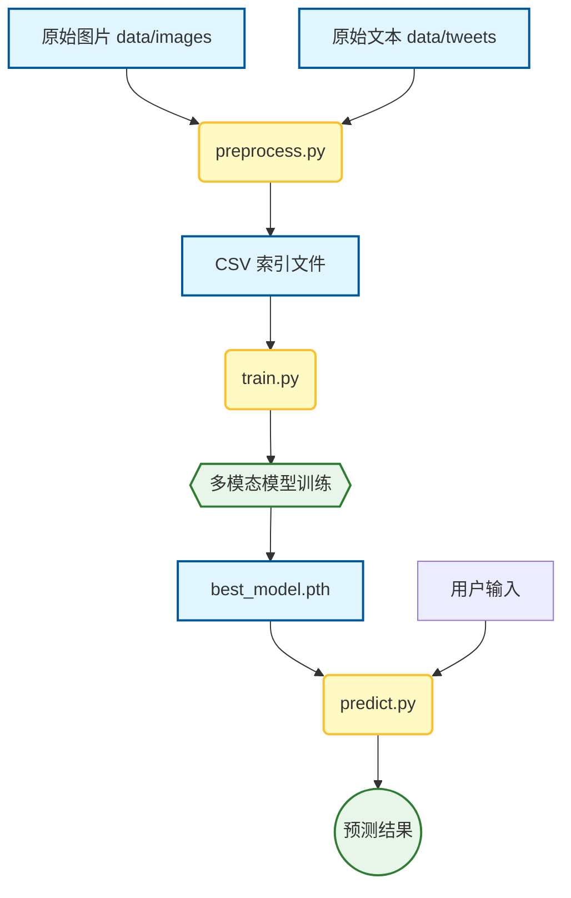
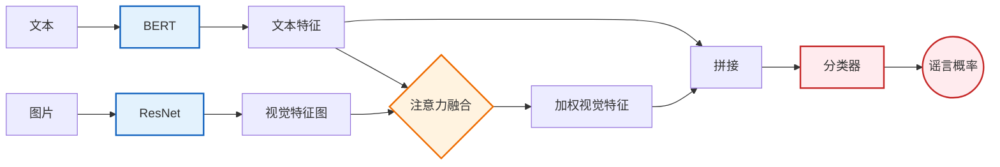

# 毕设项目：基于多模态深度学习的社交媒体谣言监测系统

## 1. 系统全局流程设计

本系统主要包含三个阶段：数据预处理、模型构建与训练、谣言预测。下图展示了数据在系统中的流转过程。

## 2. 模型核心架构

本研究采用了 **BERT + ResNet** 的双塔结构，并设计了 **文本引导的注意力机制 (Text-Guided Attention)** 来解决图文语义不对齐的问题。

* **文本分支**：使用预训练的 BERT 提取深层语义特征。
* **视觉分支**：使用 ResNet-50 提取图像的空间特征。
* **融合模块**：利用文本向量作为“查询（Query）”，动态计算图像不同区域的权重，从而让模型关注与文本描述最相关的视觉区域。

A[启动程序] --> B[加载 BERT & ResNet 权重];
B --> C{等待用户操作};

C -->|输入文本 + 上传图片| D[点击 '开始分析'];

D --> E[数据预处理];
E --> F[图片转 224x224 Tensor];
E --> G[文本转 Token IDs];

F --> H[模型推理 (forward)];
G --> H;

H --> I[BERT提取文本特征];
H --> J[ResNet提取视觉特征];

I --> K[Attention 融合层];
J --> K;

K --> L[全连接分类器];
L --> M[计算 Softmax 概率];

M --> N[界面更新: 显示红/绿结果];
N --> C;